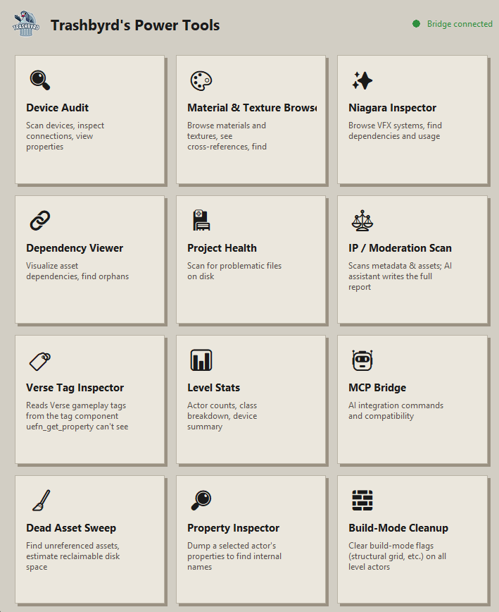

# Trashbyrd's UEFN Power Tools

An MCP server and in-editor Python bridge for live, chat-driven inspection and editing of a UEFN project — devices, assets, materials, Niagara systems, Verse, and classic actors at scale. Copy one folder, type `import pt`, connect the AI client of your choice.



> **Not affiliated with Epic Games.** Power Tools is an independent, community-built project. It is not endorsed by, supported by, or affiliated with Epic Games in any way. Fortnite and UEFN are trademarks of Epic Games, Inc.

> **Beta software.** Power Tools supports Claude Code, Codex CLI, and Gemini CLI. Other MCP clients (Cursor, Windsurf, and the others listed in [INSTALL.md](INSTALL.md)) have not yet been exercised.

## Use at your own risk

Power Tools is MIT licensed and provided as is, with no warranty and no
responsibility for UEFN crashes, corrupted or lost project data, or anything
else that happens to your project while the bridge is running. Save often, as
you would with any tool that touches a live editor session.

## What it is

Power Tools bridges an AI chat client (or your own scripts) to a **live** UEFN session. A small Python bridge runs inside UEFN's embedded Python console; a Node/TypeScript MCP server on your machine talks to that bridge over local file-based IPC — no network port, no extra UEFN plugin beyond enabling the built-in Python Editor Script Plugin. Anything the bridge can see in the open project becomes queryable, and in places editable, from your chat client while UEFN stays open with your project loaded.

The MCP server registers 30 `uefn_*` tools. Run the server and list its tools from your client for the current, authoritative list — the groupings below describe what they're for, not the exact names.

## Runs alongside Epic's official UEFN MCP server

Epic ships its own official UEFN MCP server, and you can run Power Tools alongside it without conflict. Epic's registers as `unreal-mcp` over local HTTP; Power Tools registers as `powertools` over stdio — different keys, different transports, no shared port or files. When adding Power Tools to a client config that already has an `unreal-mcp` entry, merge into the existing server object rather than replacing it; see [INSTALL.md](INSTALL.md#5-epics-official-uefn-mcp-server) for details. Epic's own documentation: https://dev.epicgames.com/documentation/fortnite/uefn-mcp

## Why use this

- **Bulk queries over classic actors.** `uefn_batch_get` (plus `uefn_batch_set` and `uefn_batch_location`) answers questions across a whole level — glob-matched, paginated.
- **Moderation and IP pre-flight scanning.** Sweep a project for content that risks a moderation rejection before you submit.
- **Dependency, asset, texture, and material sweeps.** Trace what depends on what, find unused materials, locate every actor using a given texture.
- **Tag inspection.** Look up gameplay tags across actors.
- **Offline scanning.** Some scans read UEFN's `__ExternalActors__` files directly off disk and work even when UEFN isn't running.

## What's in the box

### Native UEFN toolsets (30 tools — currently blocked by a UEFN limitation)

Power Tools ships three toolsets (`PowerToolsInspect`, `PowerToolsScan`, `PowerToolsEdit`) that register with UEFN's own Toolset Registry, the same mechanism Epic's built-in toolsets use. On current UEFN builds the registry silently drops project-side registrations (Epic's own stick; third-party ones do not), so this does not yet take effect — Power Tools detects that and says so plainly in the Output Log, and nothing else is affected. The code is in place so the feature lights up on its own if a future UEFN build accepts third-party toolsets. Details in [INSTALL.md](INSTALL.md#1b-native-uefn-toolsets-status-blocked-by-a-uefn-limitation).

### MCP tools (30)

- **Status and level info** — `uefn_status`, `uefn_list_commands`, `uefn_get_level_info`.
- **Device inspection** — `uefn_list_devices`.
- **Property get/set, single and bulk** — `uefn_get_property`, `uefn_set_property`, `uefn_batch_get`, `uefn_batch_set`, `uefn_batch_location`.
- **Actor operations** — `uefn_select_actor`, `uefn_spawn_actor`, `uefn_duplicate_actor`, `uefn_set_transform`.
- **Tags** — `uefn_tag_inspect`.
- **Audits and health** — `uefn_run_audit`, `uefn_health_scan`.
- **Moderation / IP risk** — `uefn_moderation_scan`, `uefn_moderation_report`.
- **Dependencies** — `uefn_dependency_scan`.
- **Assets** — `uefn_asset_sweep`, `uefn_inspect_asset`, `uefn_list_assets`.
- **Materials** — `uefn_material_browse`, `uefn_material_unused`.
- **Textures** — `uefn_texture_find`, `uefn_texture_on_actor`, `uefn_texture_summary`.
- **Niagara (particle systems)** — `uefn_niagara_browse`, `uefn_niagara_usage`.
- **Verse** — `uefn_verse_check` (static diagnostics via the Verse language server).

### In-UEFN Tkinter panel

Beyond the MCP tools, the bridge ships a graphical panel that runs inside UEFN itself (`import pt` from the Python console) with its own set of inspection tools, including Device Audit, Dependency Viewer, Verse Tag Inspector, Material Browser, Texture Finder, Niagara Inspector, Health Scanner, Moderation Scanner, and Property Inspector.

## Architecture

```
MCP client (e.g. Claude Code)
      |
MCP server (uefn-server.mjs, runs on Node)
      |
file-based IPC (OS temp dir)
      |
Python bridge (python/, runs inside UEFN's embedded Python console)
```

The MCP server and the in-editor Python bridge are two separate processes handing off work through files on disk. UEFN must stay open with your project loaded for live queries and edits to work. A downloaded release runs with `node uefn-server.mjs` and no build step; a source clone instead runs the TypeScript entry point (`uefn-server.ts`) via `tsx`.

## Install

See [INSTALL.md](INSTALL.md) for full setup steps, including how to connect the MCP server to your AI client of choice (Claude Code, Gemini CLI, Codex CLI, Cursor, Windsurf, Antigravity IDE, or VS Code Copilot).

Once your project is open in UEFN, start everything from UEFN's Python console by running:

```python
import pt
```

(Not `import init_unreal` — that module name now resolves to a file Epic's own plugins ship; [INSTALL.md](INSTALL.md#starting-the-bridge) explains.)

## Issues

If you run into problems, please open an issue on the GitHub repo: https://github.com/Corsair-Studios/trashbyrds-uefn-power-tools/issues — issues are reviewed periodically and fixed when possible.

## Acknowledgements

Thanks to [uefn-mcp-server](https://github.com/KirChuvakov/uefn-mcp-server) (MIT), whose work influenced the development of these tools.

## License

MIT. Copyright (c) 2026 Trashbyrd (https://x.com/thetrashbyrd).
